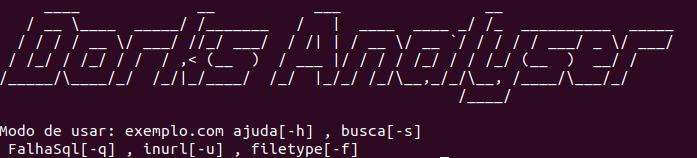

# DorksAnalyser
> O software é capaz de analisar a estrutura do site dependendo do filtro de dork utilizado. Usando a sintaxe padrão da Google Custom Search(GCS) intext,inurl,intitle etc
<br>Para identificação de possíveis vulnerabilidades.



## Uso do software

exemplo.com ajuda[-h] , busca[-s] \n FalhaSql[-q] 

## Requerimento

Python 3.6

```sh
sudo add-apt-repository ppa:deadsnakes/ppa
sudo apt-get update
sudo apt-get install python3.6
```

## Como contribuir ?

1. Fork it (<https://github.com/NicolasAoki/DorksAnalalyser/fork>)
2. Create newfeature branch (`git checkout -b newfeature`)
3. Commit suas mudanças (`git commit -m 'Adicionado funcionalidade X'`)
4. Push to the branch (`git push origin newfeature`)
5. Criar Pull Request

